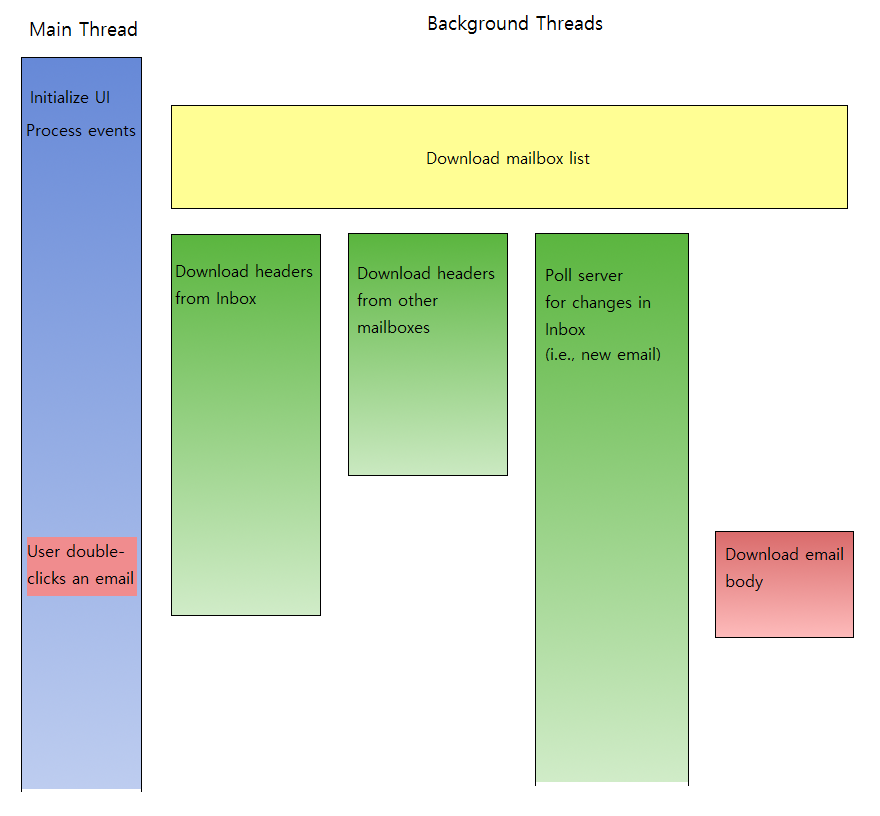
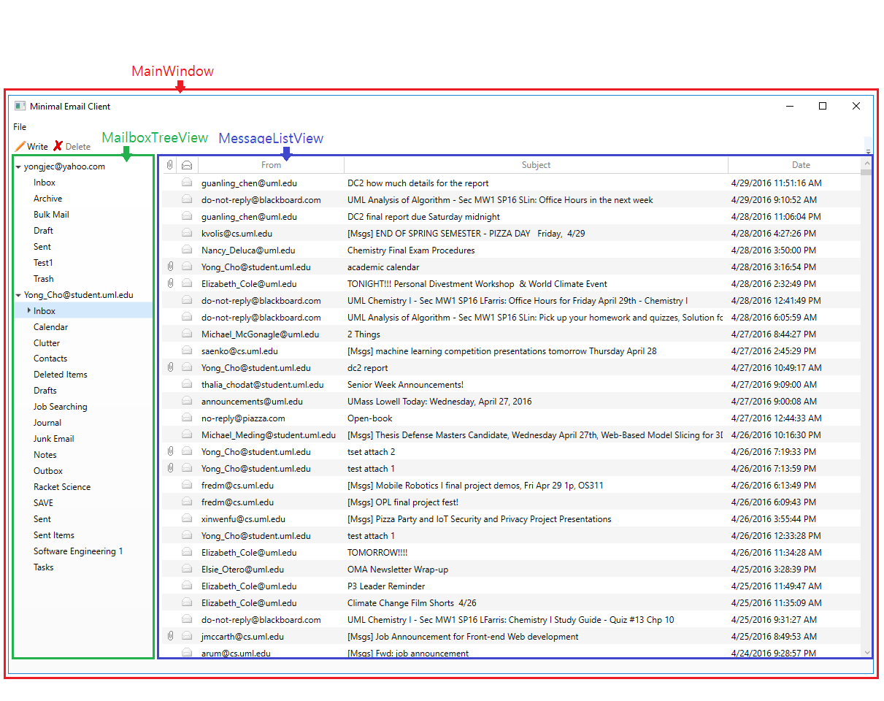

# Project Goal

The primary goal of this project was to create a working email client that is capable of communicating with commercial email servers using IMAP and SMTP protocols and provides commonly used email functionalities including:

- Listing folders and emails in the user's email account
- Reading emails in plain text/html format
- Notifying when a new email is received
- Composing and sending an email
- Replying and forwarding an email
- Handling attachments in both received email and outgoing email.

The second, and personally more important, goal of our project was to train ourselves in researching new technologies and improving our skills as developers. In order to accomplish this goal, we chose the framework and language we were not already familiar with and decided to take on the challenge of learning them as we go. Also, we took the risk of sacrificing some performance and reliability of our program by implementing the IMAP and SMTP clients on our own. We avoided the use of 3rd-party libraries which would have made the task much more trivial. Our goal was to extend our understanding of the concepts learned in class regarding mail protocols and also to familiarize ourselves in reading the RFC documents.

# Project Design

## Overview
The project is a Windows desktop application developed in C#/Visual Studio. The network communication is implemented using C# TcpClient class which is a thin wrapper around Win32 socket and abstracts low level functionalities such as DNS lookup to keep the code simple. The UI is implemented using WPF framework which is currently the most widely used Windows GUI technology. The source codes are structured using Model-View-ViewModel approach in order to promote modularity and maintainability.

## Program Flow
The program can be divided into following parts in terms of flow:

- Initializing components
- Downloading mailbox list from IMAP server
- Downloading email headers from IMAP server
- Downloading email body from IMAP server
- Sending email through SMTP server

### Initializating components
- When the program starts, app.xaml.cs instantiates MainWindow class which in turn instantiates all other view classes (\*View.xaml, \*View.xaml.cs) and their associated view-model classes (\*ViewModel.cs). It also checks the database path and creates an empty database file if it does not already exist.

### Downloading Mailbox List
Downloading mailbox list is driven by the static instance of AccountManager singleton. When the program starts, AccountManager

- calls DatabaseManager methods to load all Account objects from database.
- instantiates an ImapClient object in a background thread and downloads the list of all mailboxes for each Account object.
- updates the database if the downloaded mailbox list is different from the local mailbox list (maybe the user created or deleted a mailbox).

### Downloading Email Headers
Once the mailbox list is synchronized, email headers are downloaded for each mailbox. Downloading emails is driven by MessageManager class and is accomplished in three background threads per user email account. Each thread creates an instance of ImapClient class and makes separate connections to the IMAP server. 

- The first thread downloads all email headers in the Inbox starting from the most recent to the oldest. As it downloads the headers, it compares them with the local copies obtained from the DatabaseManager and adds/removes/updates them as necessary so the local copies match the server copies. It also raises an event for each message added, removed, or updated. The events are processed by the MessageListViewModel class residing in the UI thread which then makes necessary updates to the email list in the main window. Once all headers are downloaded, the thread terminates.
- The second thread downloads email headers from folders other than the Inbox. It uses the same algorithm as the first thread and goes through each mailbox one by one to download all the headers in it. 
- When MessageManager starts downloading the Inbox, it also runs ImapClient.BeginMonitor method which runs in the third thread and polls the server in 5-second interval to monitor any changes in the Inbox such as arrival of a new email, deletion of an email, or emails being marked as read/unread. When such change is detected, it raises an event which is first caught by the MessageManager to update the local email list then is relayed to the MessageListViewModel to update the UI.

In downloading the Inbox and the other mailboxes in separate threads, we considered the fact that typical email client users would spend most of their time viewing Inbox so the Inbox must be downloaded as soon as possible. However, Inbox is also where most emails are found, and it could take up to several minutes to download all headers in the Inbox depending on how many emails are in it. By downloading the rest of the mailboxes in a separate thread, users would be able to see an update in those mailboxes without having to wait for the inbox to be completely downloaded.

### Downloading Email Body

Downloading an email body is strictly driven by a user event. The process is initiated by the user double-clicking on one of the emails within the MessageListView UI. At this point, 

- MessageListView opens MessageContentView UI as a popup and passes the selected Message object to the MessageContentViewModel. 
- MessageContentViewModel then instantiates an ImapClient class to make a connection and fetch the email body. 
- Once the email body is downloaded, it is stored in the database so it can be retrieved next time the user opens the same email. The same email body will never be downloaded twice. 
- Once the raw email body is downloaded, MessageContentViewModel calls MIMEUtility methods to extract the email text and the attached files from the raw MIME entity so they can be passed to MessageContentView UI and displayed appropriately to the user.

There is a room for an improvement in this design. Since downloading an email body incurs a round-trip delay, we could improve user experience by pre-downloading some email bodies in the background without waiting for the user to open the email. We had this change in mind but haven’t got to implement it at this point.

### Sending Emails
 Sending Emails is composed of many distinct parts. The Email model which contains all header and message content information.  The SMTP Service includes all the SMTP protocols which handle connection and communication between the SMTP server and the client.  The NewEmailViewModel is the interface between the underlying models, services, and graphical component of the email editor.  The NewEmailView allows the user to interact with the back end components of the client.
The SMTP service does an initial greeting with the SMTP server using an insecure connection and upgrades it to a secure connection using SSL/TLS.  Once a secure connection is established, the authentication process is initiated in 64bit encryption.  After the client has been authenticated, the SMTP service must then provide the SMTP server with the account names of the sender and the recipients.  The DATA command informs the server that message contents will be sent once the server has acknowledged the request.  All pertinent email headers are sent in sequence and then the content-type.  Once the Content-type and boundaries are provided, the server will accept all messages encapsulated within the denoted boundary tags if the encoding types are validated by the server.  
Messages containing file attachments utilize the MIME standard, which was developed by Nathaniel Borenstein and Ned Freed.  These attachments are another component of the multipart email with base64 encoding to convert binary into 7-bit ASCII.  Modern servers now run extended SMTP with an optional 8-bit support via the 8bit MIME extension.  Our Email sender automatically selects the best encoding type for the message contents and encodes the contents appropriately.

# File Structure

<ul>
<li><strong>MinimalEmailClient</strong>
<ul>
<li><strong>Common</strong> &nbsp;Globals.cs</li>
<li><strong>Events</strong> &nbsp;EventCollection.cs &nbsp;GlobalEventAggregator.cs</li>
<li><strong>Models</strong> &nbsp;Account.cs &nbsp;Mailbox.cs &nbsp;Message.cs &nbsp;OutgoingEmail.cs</li>
<li><strong>Notifications</strong> &nbsp;MessageContentViewNotification.cs &nbsp;OpenContactsNotification.cs &nbsp;WriteNewMessageNotification.cs</li>
<li><strong>Resources</strong> &nbsp;MECResourceDictionary.xaml</li>
<li><strong>Services</strong> &nbsp;AccountManager.cs &nbsp;DatabaseManager.cs &nbsp;Decoder.cs &nbsp;ImapClient.cs &nbsp;ImapParser.cs &nbsp;MessageManager.cs &nbsp;MimeUtility.cs &nbsp;NewAccountValidator.cs &nbsp;SmtpClient.cs</li>
<li><strong>ViewModels</strong> &nbsp;AccountViewModel.cs &nbsp;AddAccountViewModel.cs &nbsp;AttachmentViewModel.cs &nbsp;MailboxListView.cs &nbsp;MailboxTreeViewModel.cs &nbsp;MailboxViewModel.cs &nbsp;MainWindowViewModel.cs &nbsp;MessageContentViewModel.cs &nbsp;MessageHeaderViewModel.cs &nbsp;MessageListViewModel.cs &nbsp;NewEmailViewModel.cs &nbsp;OpenContactsViewModel.cs</li>
<li><strong>Views</strong> &nbsp;AddAcountView.xaml &nbsp;AddAcountView.xaml.cs &nbsp;MailboxTreeView.xaml &nbsp;MailboxTreeView.xaml.cs &nbsp;MainWindow.xaml &nbsp;MainWindow.xaml.cs &nbsp;MessageContentView.xaml &nbsp;MessageContentView.xaml.cs &nbsp;MessageListView.xaml &nbsp;MessageListView.xaml.cs &nbsp;NewEmailView.xaml &nbsp;NewEmailView.xaml.cs &nbsp;NewMessageBalloon.xaml &nbsp;NewMessageBalloon.xaml.cs &nbsp;OpenContactsView.xaml &nbsp;OpenContactsView.xaml.cs
<ul>
<li><strong>Converters</strong> &nbsp;BooleanToEnvelopImageSourceConverter.cs &nbsp;BoolToVisibilityConverter.cs &nbsp;FilePathToIconImageConverter.cs &nbsp;FileSizeToStringConverter.cs &nbsp;LeftMarginMultiplierConverter.cs</li>
<li><strong>Utilities</strong> &nbsp;FixedWidthGridViewColumn.cs &nbsp;PasswordBindingHelper.cs &nbsp;TreeViewItemExtensions.cs &nbsp;WebBrowserHelper.cs</li>
</ul>
</li>
</ul>
</li>
</ul>

In structuring our codes, we divided them into three layers - Models, Views, View-Models(Controllers). Each layer has distinct roles and is loosely coupled (or not coupled at all) with the other layers to maximize modularity and maintainability.

- [UML Class Diagram](https://www.dropbox.com/s/3sths8xy0ag7rki/MEClient.html?dl=1) - Open the .html file with a web browser.

### Model Layer (Core Logic/Data Access)
Files in the following folders belong to this layer:

- MinimalEmailClient/Models
- MinimalEmailClient/Services

This layer defines main data types used in the program such as Account, Mailbox, and Message. It also implements core functionalities such as sending/receiving emails and accessing database. Here are some of the classes in this layer and their functionalities.

- ImapClient: Implements and encapsulates all necessary logic to communicate with the IMAP server in order to download emails and make necessary updates to the server data.
- DatabaseManager: Provides methods that encapsulates database connection and abstracts CRUD operations.
- AccountManager: Maintains a collection of all Account and Mailbox objects and makes them available to view-model classes. Uses methods provided by ImapClient class to synchronize the list of mailboxes with the IMAP servers in the background.
- MessageManager: Maintains a collection of all email (Message) objects and uses methods provided by ImapClient class to keep the email collection current and download any new emails.
- SmtpClient: 

### View Layer (Presention)
Files in the following folders belong to this layer:

- MinimalEmailClient/Views
- MinimalEmailClient/Views/Converters
- MinimalEmailClient/Views/Utilities
- MinimalEmailClient/Resources

View classes implement the UI elements such as windows, popups, menus, toolbars, buttons, labels, input forms, and so on. They also define the positioning and styling of the elements such as width, height, margin, padding, fore/background color, border thickness, font face and size and such. As for a typical Windows GUI project, we defined all UI elements and styles in XAML. Here are the visual representations of some of the view classes.

### View-Model Layer (Interaction)
Files in the following folders belong to this layer:

- MinimalEmailClient/ViewModels
- MinimalEmailClient/Notifications

View-model classes use services provided by the model classes to retrieve data and makes them available to the view classes in a format suitable for display. For example, MessageContentViewModel uses public methods in ImapClient class to download a raw email body and then again uses public methods in MimeUtility class to parse and extract email text and attachments from the body. The parsed text and files are then passed onto MessageContentView class to be displayed to the user.

By convention, we named view-model classes after the view classes that they serve. For example, 'AddAccountViewModel' class provides data for 'AddAccountView' class and also handles user actions from that view class; similar to what 'MessageContentViewModel' does to 'MessageContentView'.

